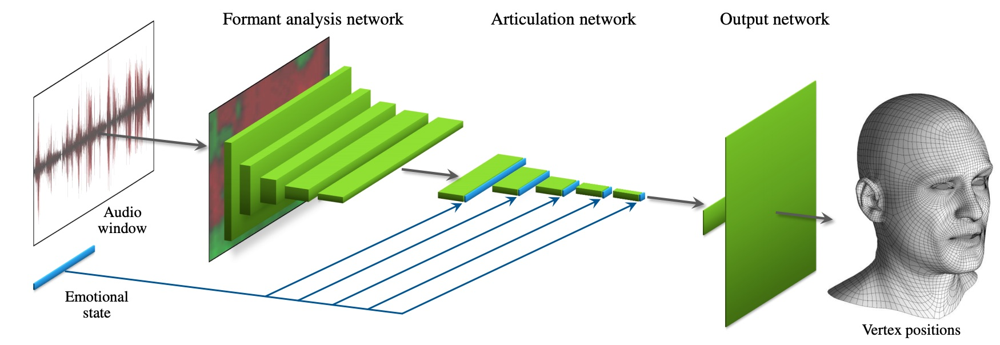

# Survey-Speech2FE

## 3D

- (SIGGRAPH2017) Audio-Driven Facial Animation by Joint End-to-End Learning of Pose
and Emotion [[Paper](https://dl.acm.org/doi/abs/10.1145/3394171.3413844)][[Demo](https://www.youtube.com/watch?v=lDzrfdpGqw4)]

[:white_small_square:Audio :white_small_square:Emotional states]

:white_small_square: The network learns a mapping from input waveforms to the 3D vertex coordinates of
a face model, and simultaneously discovers a latent code that disambiguates the variations in facial expression that cannot be explained by the audio alone.

## 2D

- (ACM MM2020) Talking Face Generation with Expression-Tailored Generative
Adversarial Network [[Paper](https://dl.acm.org/doi/abs/10.1145/3394171.3413844)] 

  [:white_small_square:Audio :white_small_square:Emotion :white_small_square:Landmark :white_small_square:Identity]

  :white_small_square:It uses an expression encoder to disentangle the emotion information from expressional video clips, thus generating high quality expression-tailored face videos beyond audio-lip
synchronization.

