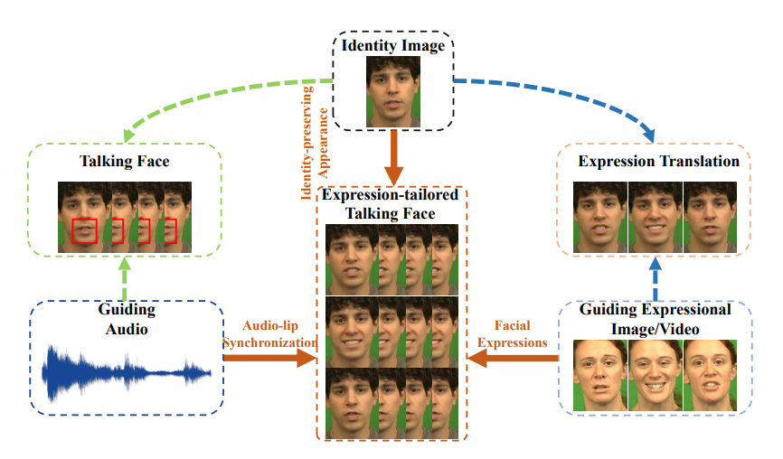

# Survey-Speech2FE

## 3D

## 2D

- (ACM MM2020) Talking Face Generation with Expression-Tailored Generative
Adversarial Network [[paper link](https://dl.acm.org/doi/abs/10.1145/3394171.3413844)] 

  [:white_small_square:Audio :white_small_square:Emotion :white_small_square:Landmark :white_small_square:Identity]
  [:diamonds:The key idea: It uses an expression encoder to disentangle the emotion information from expressional video clips, thus generating high quality expression-tailored face videos beyond audio-lip
synchronization.]

