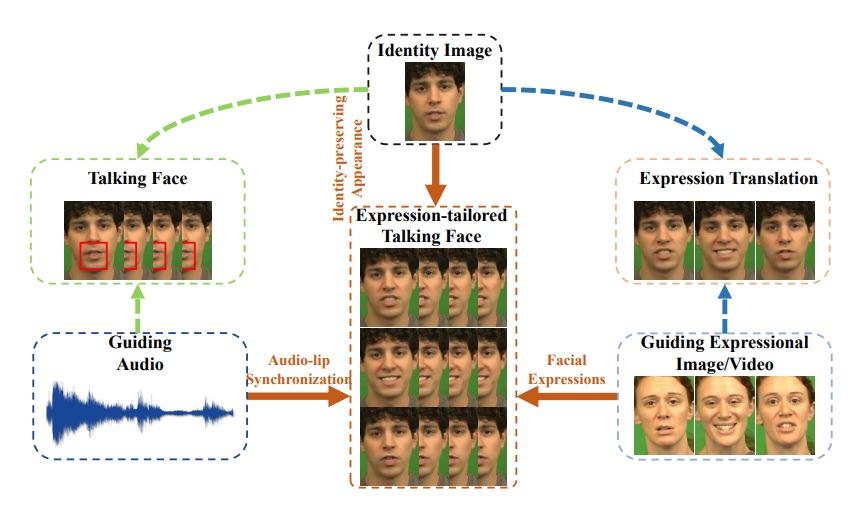

# Survey-Speech2FE

## 3D

- (SIGGRAPH 2017) Audio-Driven Facial Animation by Joint End-to-End Learning of Pose
and Emotion [[Paper](https://users.aalto.fi/~laines9/publications/karras2017siggraph_paper.pdf)][[Demo](https://www.youtube.com/watch?v=lDzrfdpGqw4)]
   
  > The network learns a mapping from input waveforms to the 3D vertex coordinates of
a face model, and simultaneously discovers a latent code that disambiguates the variations in facial expression that cannot be explained by the audio alone.

- (SIGGRAPH 2017) A Deep Learning Approach for Generalized Speech Animation [[Paper](http://graphics.cs.cmu.edu/wp/wp-content/uploads/2017/06/sg2017-0509-final-1.pdf)][[Demo](https://www.youtube.com/watch?v=GwV1n8v_bpA)]

  > The approach uses a sliding window predictor that learns the mapping from phonemes to mouth movements. It is speaker-independent and the generated animation can be retargeted to any animation rig.

- (SIGGRAPH 2018) VisemeNet: Audio-Driven Animator-Centric Speech Animation [[Paper](https://arxiv.org/pdf/1805.09488.pdf)][[Demo](https://www.youtube.com/watch?v=kk2EnyMD3mo)]

  > The architecture processes an audio signal to predict JALI-based viseme representations.

- (SIGGRAPH 2016) JALI: An Animator-Centric Viseme Model for Expressive Lip Synchronization [[Paper](http://www.dgp.toronto.edu/~elf/JALISIG16.pdf)][[Demo](https://www.youtube.com/watch?v=vniMsN53ZPI)]

  > Given an audio and speech transcript, the system generates expressive lip-synchronized facial animation. They draw from psycholinguistics to capture this variation using two visually distinct anatomical actions: Jaw and Lip. A template JALI 3D facial rig is constructed.

- (CVPR 2019) Capture, learning, and synthesis of 3D speaking styles [[Paper](https://openaccess.thecvf.com/content_CVPR_2019/papers/Cudeiro_Capture_Learning_and_Synthesis_of_3D_Speaking_Styles_CVPR_2019_paper.pdf)][[Demo](https://www.youtube.com/watch?v=XceCxf_GyW4)]

  > Based on FLAME, the network learns to transform audio features to 3D vertex displacement. It generalizes well across various speech sources, languages, and 3D face templates. 

- (CVPR Workshop 2017) Speech-driven 3D Facial Animation with Implicit Emotional Awareness: A Deep Learning Approach [[Paper](https://openaccess.thecvf.com/content_cvpr_2017_workshops/w41/papers/Pavlovic_Speech-Driven_3D_Facial_CVPR_2017_paper.pdf)]

  > The framework learns to map speech to head rotations and expression weights of a 3D blendshape model (FaceWarehouse). They use the [3D face tracker](https://projet.liris.cnrs.fr/imagine/pub/proceedings/ICPR-2016/media/files/1195.pdf) to extract these 3D animation parameters (head rotations and AU intensities) from videos as the ground truth.

- (SIGGRAPH 2006) Expressive Speech-Driven Facial Animation [[Paper](https://people.cs.vt.edu/~yongcao/publication/pdf/cao06_tog.pdf)][[Demo](https://www.youtube.com/watch?v=iH3ngccpP2w)]

  > They derive a generative model of expressive facial motion that incorporates emotion control while maintaining accrate lip-synching.

- (SIGGRAPH Asia 2015) Video-Audio Driven Real-Time Facial Animation [[Paper](http://xufeng.site/publications/2014/cameraReady_sigAsia15.pdf)][[Demo](https://www.youtube.com/watch?v=EJ0uaBru17E)]

  > The DNN acoustic model is applied to extract phoneme state posterior
probabilities (PSPP) from the audio. After that, a lip motion regressor refines the 3D mouth shape based on both PSPP and expression weights of the 3D mouth shapes. Finally, the refined 3D mouth shape is combined with other parts of the 3D face to generate the final result.

- (ICMI 2020) Modality Dropout for Improved Performance-driven
Talking Faces [[Paper](https://arxiv.org/pdf/2005.13616.pdf)]

  > Speech-related facial movements (mouth and jaw) are generated using audio-visual information, and non-speech facial movements (the rest of the face and the head pose) are generated using only visual information

- (SIGGRAPH 2017) Synthesizing Obama: Learning Lip Sync from Audio [[Paper](https://grail.cs.washington.edu/projects/AudioToObama/siggraph17_obama.pdf)][[Demo](https://www.youtube.com/watch?v=9Yq67CjDqvw)]

  > It synthesizes only the region around the mouth and borrow the rest of Obama from a target video. The system first converts audio to the sparse mouth shape, then generates photo-realistic mouth texture, and finally composites it into the mouth region of a target video. 

## 2D

- (WACV 2020) Animating Face using Disentangled Audio Representations [[Paper](https://arxiv.org/pdf/1910.00726.pdf)] 

  > It claims that the proposed approach is the first attempt to explicitly learn emotionally and content aware disentangled audio representations for facial animation. The framework learns to disentangle audio sequences into phonetic content, emotional tone, and other factors.

- (ACM MM 2020) Talking Face Generation with Expression-Tailored Generative
Adversarial Network [[Paper](https://dl.acm.org/doi/abs/10.1145/3394171.3413844)] 

  > It uses an expression encoder to disentangle the emotion information from expressional video clips, thus generating high quality expression-tailored face videos beyond audio-lip
synchronization.

- (SIGGRAPH ASIA 2020) MakeItTalk: Speaker-Aware Talking-Head Animation [[Paper](https://arxiv.org/pdf/2004.12992.pdf)][[Demo](https://www.youtube.com/watch?v=vUMGKASgbf8)][[Project Webpage](https://people.umass.edu/yangzhou/MakeItTalk/)]

  > The audio content robustly controls the motion of lips and nearby facial regions, while the speaker information determines the specifics of facial expressions and the rest of the talking-head dynamics. They use the prediction of facial landmarks reflecting the speaker-aware dynamics.

- (BMVC 2017) You Said That? Synthesising Talking Faces from Audio [[Paper](https://dl.acm.org/doi/abs/10.1145/3394171.3413844)][[Demo](https://www.youtube.com/watch?v=lXhkxjSJ6p8)]

  > The overall Speech2Vid model is a combination of two encoders (an identity encoder and an audio encoder), and a decoder that generates images corresponding to the audio.

- (AAAI 2019) Talking Face Generation by Adversarially Disentangled Audio-Visual Representation [[Paper](https://arxiv.org/pdf/1807.07860.pdf)][[Demo](https://www.youtube.com/watch?v=-J2zANwdjcQ&t=2s)]  

  > The proposed method disentangles the subject-related information and the
speech-related information through an adversarial training process.

- (IEEE Transactions on Affective Computing2019) Speech-Driven Expressive Talking Lips with Conditional Sequential Generative Adversarial Networks [[Paper](https://arxiv.org/pdf/1806.00154.pdf)]

- (INTERSPEECH 2016) Expressive Speech Driven Talking Avatar Synthesis with DBLSTM using
Limited Amount of Emotional Bimodal Data [[Paper](https://www.isca-speech.org/archive/Interspeech_2016/pdfs/0364.PDF)]
